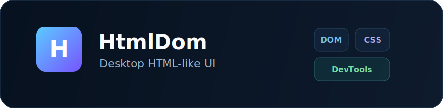
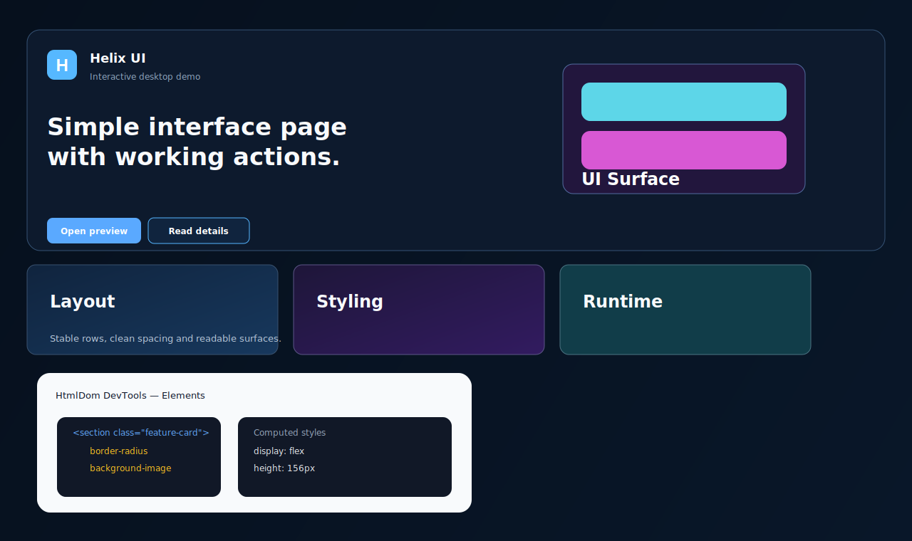

<p align="center">
  
</p>

# HtmlDom

Desktop HTML-like UI library extracted into a standalone multi-module repository.

This is a desktop stack, not browser/WebView: retained DOM, HTML-like markup, CSS cascade/layout, Lua scripting as the JavaScript replacement, font registry, Font Awesome registry, and a Swing/JFrame renderer.


## Screenshots

<p align="center">
  
</p>

## Modules

- `html-dom-core` — DOM, HTML registry, markup parser, CSS parser/cascade/layout, user-agent styles.
- `html-dom-fonts` — font registry and built-in classpath font registration.
- `html-dom-icons-fontawesome` — Font Awesome icon registry, glyph descriptors, TTF resources and font registration hooks.
- `html-dom-scripting-lua` — Lua runtime and DOM bindings; Lua is used instead of browser JavaScript.
- `html-dom-devtools` — DOM/layout/line/inline/paint/scroll inspection snapshots.
- `html-dom-desktop` — Swing/JFrame renderer and bundled showcase launcher.

## Font resources

Built-in fonts are registered from:

```text
modules/html-dom-fonts/src/main/resources/html-dom/fonts/built-in-fonts.json
```

The bundled registry loads the copied FS Elliot / Roboto Mono font files from `Java2DGame`.

## Font Awesome

Font Awesome TTFs are copied into:

```text
modules/html-dom-icons-fontawesome/src/main/resources/html-dom/icons/fontawesome/
```

The desktop renderer registers them through `FontAwesomeFonts.register(HtmlDomFonts.registry())`, then resolves icon classes such as:

```html
<i class="fa-solid fa-code"></i>
<i class="fa-solid fa-bolt"></i>
```

## Lua instead of JS

Bundled Lua lives at:

```text
modules/html-dom-desktop/src/main/resources/html-dom/bundled/showcase.lua
```

The Swing panel loads it through `HtmlDomLuaRuntime`; scripts can mutate DOM via the exposed `dom` table.

## Build

```bat
gradlew.bat clean compileJava --console=plain --no-daemon
```

## Run desktop showcase

```bat
gradlew.bat :html-dom-desktop:run --console=plain --no-daemon
```

## Build executable showcase jar

```bat
gradlew.bat bundledHtmlUiJar --console=plain --no-daemon
```

Run it:

```bat
java -jar modules\html-dom-desktop\build\libs\html-dom-ui-1.0.0-bundled.jar
```

## Paint tree / scroll containers

The core layout result now carries block boxes, line boxes, inline boxes and scroll boxes. The paint layer is split into physical phases:

```text
paintBackground
paintBorder
paintContent
paintOutline
paintPositionedDescendants
paintScrollbars
```

DevTools snapshots include layout nodes, paint nodes and scroll container nodes with content size, viewport size and scroll offsets.


## Maven package

Artifacts are published as GitHub Packages when a release tag such as `v1.0.0` is pushed.

Gradle repository setup:

```gradle
repositories {
    maven {
        url = uri('https://maven.pkg.github.com/Take-Some/JavaDOM')
        credentials {
            username = findProperty('gpr.user') ?: System.getenv('GITHUB_ACTOR')
            password = findProperty('gpr.key') ?: System.getenv('GITHUB_TOKEN')
        }
    }
}
```

Primary dependency examples:

```gradle
dependencies {
    implementation 'dev.takesome:html-dom-core:1.0.0'
    implementation 'dev.takesome:html-dom-desktop:1.0.0'
    implementation 'dev.takesome:html-dom-fonts:1.0.0'
    implementation 'dev.takesome:html-dom-icons-fontawesome:1.0.0'
    implementation 'dev.takesome:html-dom-scripting-lua:1.0.0'
    implementation 'dev.takesome:html-dom-devtools:1.0.0'
}
```

Local verification:

```bat
gradlew.bat publishToMavenLocal --console=plain --no-daemon
```

## CI / release / packages

GitHub Actions are configured in:

```text
.github/workflows/ci.yml
.github/workflows/release.yml
```

- `CI` runs on `main` and pull requests.
- `Release` runs on version tags such as `v1.0.0`.
- Maven artifacts are published to GitHub Packages under `dev.takesome:*:1.0.0`.
- The bundled desktop showcase jar is attached to the GitHub release.

Create a release locally:

```bat
git tag v1.0.0
git push origin main v1.0.0
```
